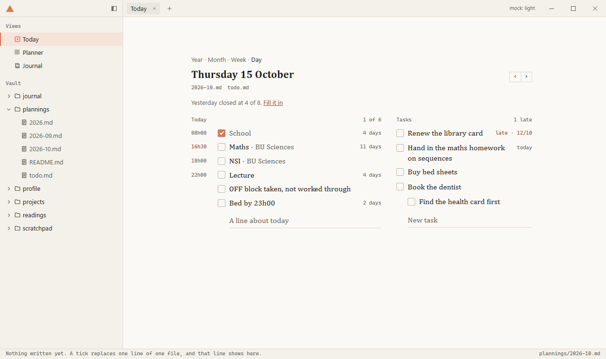
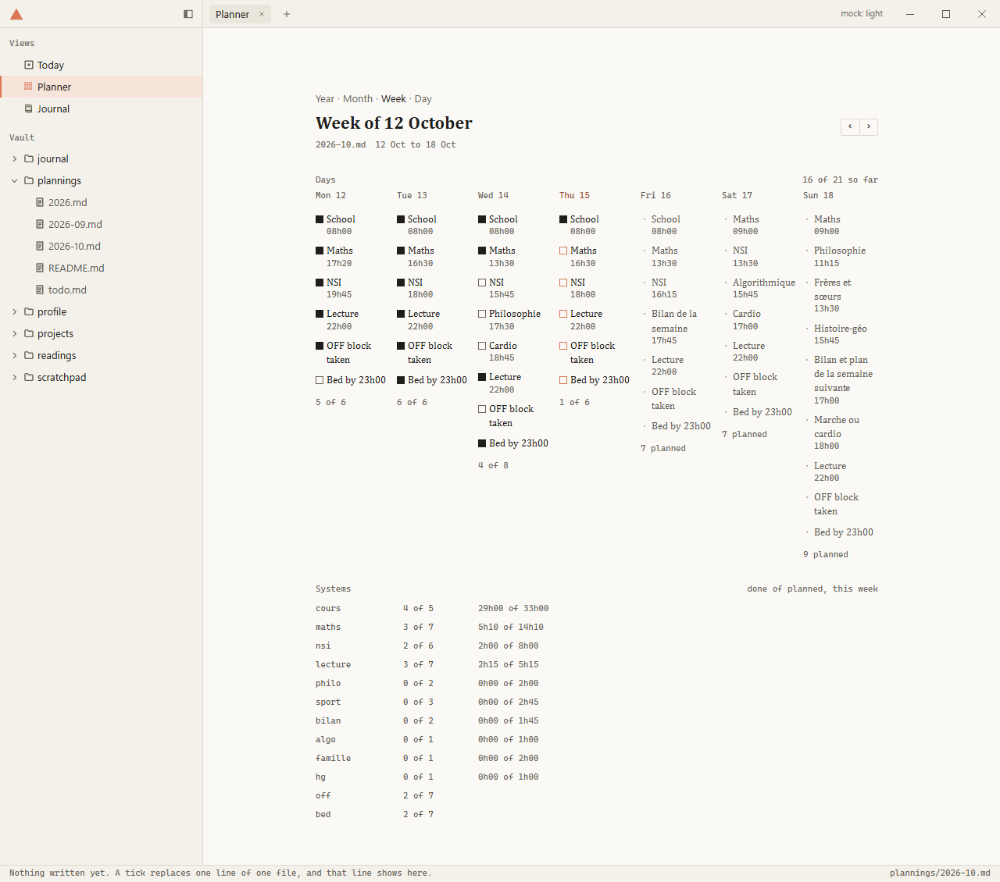
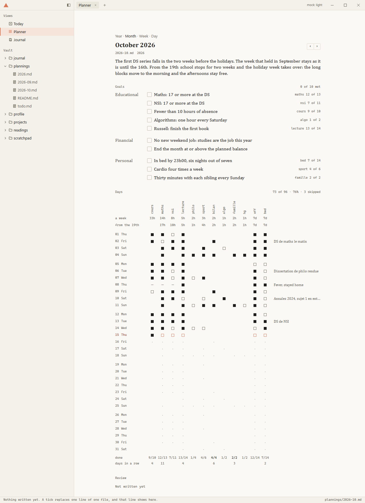
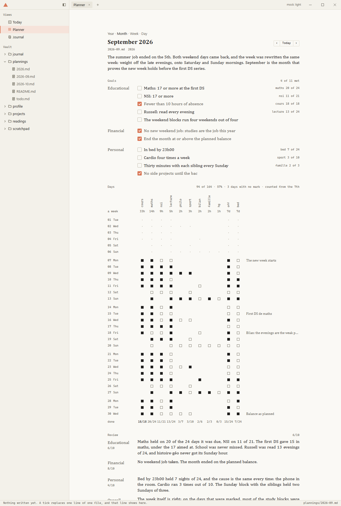
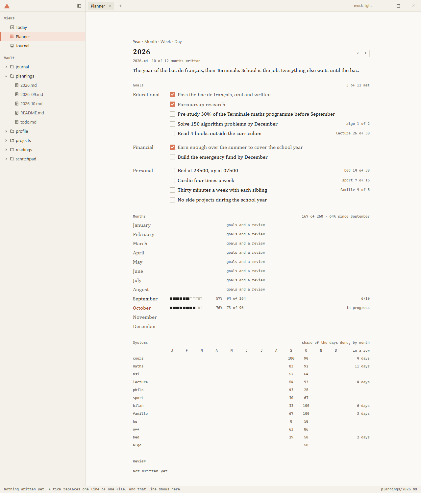
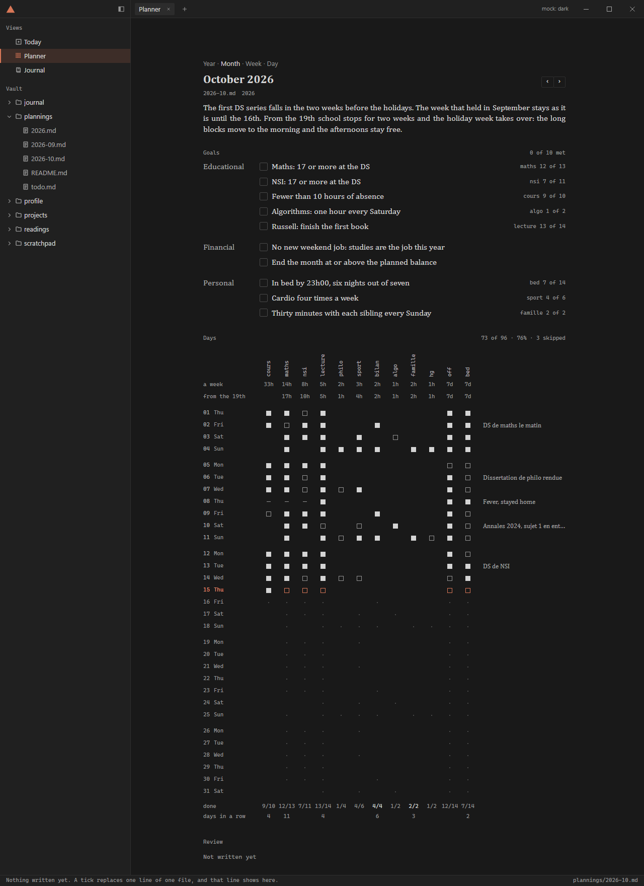

# The planner: one file a month, one row a day

A proposal, on the `experimental` branch. Nothing here is built into the app and no vault was
touched. It answers three things: how the planning files are kept, how a month, a year and a
review get written, and what the app's pages over them look like.

What is in this folder:

| | |
|---|---|
| `README.md` | this proposal |
| `examples/plannings/` | a planner folder in the proposed shape: its contract (`README.md`), a year, two months, the todo list. The week is a real one; the marks are invented |
| `mock/` | the four pages, drawn from those example files with the app's own stylesheets. A tick changes the text in memory and the status bar shows the one line the app would write |
| `shots/` | the same pages as pictures, both themes |

To look at the mock: `node proposals/planner/mock/serve.mjs`, then
http://127.0.0.1:5199/proposals/planner/mock/ (it runs beside `npm run dev`). Its clock is fixed
on Thursday 15 October 2026, 17h10, so the pages always match the examples.

## The answer in short

1. One folder and three kinds of file, all markdown: a year, a month, the todo list. No log, no
   calendar file, no JSON.
2. A month file is five sections: the title, Goals, Week, Days, Review. What was wanted, how the
   days were meant to go, what was done each day, how it ended. All of it in one place.
3. The daily record is a table in the month file: a row per day, a column per system, one
   character per cell. It replaces the log.
4. One small word ties a month together. The word in brackets on a line of the week, `[maths]`,
   is its **system**: a column of the days table, a count beside any goal that names it, a run
   that carries from month to month.
5. Two numbers, never mixed. **Execution** is counted from the days. The **grade** is written by
   you in the review.
6. Every write is one line, checked against what was read. The host needs no new command.
7. The pages are the files, typeset: Day, Week, Month and Year, one zoom.

## What the current setup costs

This is read from the real September, not assumed.

- **The log cannot be read.** It holds 38 lines for 8 days, and 13 of them are a mark taken back
  or made again. It takes replaying JSON to learn that 22 things were done. The same record is
  8 rows of a table.
- **The record stops on the 21st.** Ten systems to confirm in a box of their own, and since the
  last change every block as well: that is more confirming than gets done.
- **One intention is written three times.** "Cardio four times a week" is a goal, `Cardio (lun
  mer sam dim)` is a system, and the cardio blocks sit in the timetable on Wednesday, Saturday
  and Sunday. The second and the third already disagree. Systems and timetable are one list
  kept twice.
- **Nothing connects a goal to the days.** The month page shows goals, then a grid, and the
  reader does the linking.
- **A week cannot change without rejudging the past.** September's week was rewritten in its
  first week. Every day before the change is judged by a week that did not exist yet.
- **The reviews already carry grades**, each written its own way: `Grade: 7/10`, `Overall:
  60/100`, a success rate in percent. Nothing can read them, so no year can show them.
- **One log for every year.** Each tick rewrites, and Drive uploads again, a file that only
  grows. A sync conflict there touches every year at once.

## The structure

### The folder

```
plannings/
  README.md     the contract: the shape of the files, how a day counts, the rituals
  2026.md       a year
  2026-09.md    a month
  2026-10.md
  todo.md       the todo list
```

Flat. When a year is over its thirteen files can move into a folder named for it (`2026/`); the
reader finds both, as it does today. `systems.jsonl` stays where it is, untouched and no longer
read. The contract is `examples/plannings/README.md`: it is written to be dropped into the vault
as it is, and it is what an agent reads.

### A month

`examples/plannings/2026-10.md` is a whole one. Its skeleton:

```markdown
# October 2026

The first DS series falls in the two weeks before the holidays. The week that held in
September stays as it is until the 16th.

# Goals

Educational

- [ ] Maths: 17 or more at the DS [maths]
- [ ] Fewer than 10 hours of absence [cours]
- [ ] Russell: finish the first book [lecture]

Financial

- [ ] No new weekend job: studies are the job this year

Personal

- [ ] In bed by 23h00, six nights out of seven [bed]
- [ ] Cardio four times a week [sport]

# Week

- 22h00 à 22h45 Lecture [lecture]
- OFF block taken, not worked through [off]
- Bed by 23h00 [bed]

Lundi

- 08h00 à 17h00 School [cours]
- 17h20 à 19h00 Maths · BU Sciences [maths]
- 19h45 à 20h45 NSI · maison, casque [nsi]

Mardi, Jeudi

- 08h00 à 16h00 School [cours]
- 16h30 à 18h00 Maths · BU Sciences [maths]
- 18h00 à 19h00 NSI · BU Sciences [nsi]

Mercredi

- 17h30 à 18h30 Philosophie · BU Sciences [philo]
- 18h45 à 19h30 Cardio, retour en courant [sport]

# Week from 2026-10-19

Holidays until 1 November. No school: the long blocks move to the morning.

Lundi à Vendredi

- 09h00 à 12h00 Maths, annales · BU Sciences [maths]

# Days

| Day    | cours | maths | nsi | lecture | philo | sport | off | bed | Note                 |
|--------|-------|-------|-----|---------|-------|-------|-----|-----|----------------------|
| 01 jeu | x     | x     | .   | x       |       |       | x   | x   |                      |
| 02 ven | x     | .     | x   | x       |       |       | x   | x   | DS de maths le matin |
| 07 mer | x     | x     | .   | x       | .     | x     | x   | .   |                      |
| 08 jeu | -     | -     | -   | x       |       |       | x   | x   | Fever, stayed home   |
| 15 jeu | x     | .     | .   | .       |       |       | .   | .   |                      |
| 16 ven |       |       |     |         |       |       |     |     |                      |

# Review

_gap: written at the end of the month_
```

What each section holds:

- **The title** and, under it, a paragraph on why the month matters.
- **Goals.** Area labels as today, one word on a line. A goal is a checkbox, ticked when it is
  met. A word in brackets at its end names the system it leans on.
- **Week.** The one list of what gets confirmed. A line with times is a block, a line without is
  a rule for the day. Lines above the first weekday label are for every day. A label is a line
  of weekday names, and it may name several: `Mardi, Jeudi`, `Lundi à Vendredi`. Tuesday and
  Thursday are the same day in the real week, and Lecture is at 22h00 seven days out of seven:
  written this way the real week is 28 lines, where it took 35 blocks and 10 systems.
- **Week from a date.** A week that takes over on that day: the holidays, or a week rewritten
  mid-month. The days before it keep the week they had.
- **Days.** A row per day, made empty when the month is started. `x` done. `.` due, not done.
  `-` dropped on purpose that day, counted for nothing. Empty, nothing recorded. Then a few
  free words on the day.
- **Review.** Prose, as today. The only parts read are `Grade: 7/10` under an area and
  `Overall: 6/10`.

A line of the week is the line you already write. Only two things are new in it: the brackets
now name what is tracked instead of a colour, and a label can hold more than one day.

### A year

`examples/plannings/2026.md`. Three sections: the title and a paragraph, Goals, Review. Goals
and Review read exactly as a month's. A milestone is ticked the day it happens. A goal with a
system shows that system's count over the year. Nothing about the months is written in the
year file: the Year page reads the twelve month files.

### The todo list

Unchanged. `todo.md`, the same task lines, the same two writes. It works.

### How a day counts

Five rules give every number on every page. They are in the contract word for word, so an agent
reports the same numbers the app shows.

1. A system is **planned** on a day when the week in force that day has a line for it on that
   weekday.
2. It is **due** when its cell is `x` or `.`, or when it is planned and the cell is empty. Never
   when the cell is `-`.
3. It is **done** when its cell is `x`.
4. A month counts from its first marked day. From there every past day counts in full, a day
   with no mark included. Today counts only what is done. Days to come count nothing.
5. The **rate** is done over due. A system's **run** is its due days done in a row, back from
   today, across months. A day it is not due, a `-` and today still open do not break it.

Rule 4 is the strict one, on purpose. A month started late is not punished for the days before
its first mark. After that, a day you did not record is a day you did not execute. The page
says so in words: "3 days with no mark", "counted from the 7th". Filling in a past day is one
click in the Month page, or one sentence to an agent.

### The two numbers

- **Execution** is the rate. It is measured, it needs no judgement, and it exists for a day, a
  week, a month, a year and each system.
- **The grade** is yours, out of ten, per area and overall, written in the review as you have
  written it since 2024. It says whether the goals were reached, which the days cannot know: a
  mark at a DS, a balance at the end of the month.

The Year page puts both beside each month. It computes no third number from them. A year's own
grade is written in the year's review, with the twelve months in front of you.

### What gets written

| Action | Write |
|---|---|
| a line of a day ticked, unticked or skipped | `replaceLine`: that day's row |
| the day's note | `replaceLine`: that day's row |
| a goal ticked | `replaceLine`: that goal's line |
| a task ticked | `replaceLine` in `todo.md`, as today |
| a task added | `appendLine` in `todo.md`, as today |
| Start a month, start a year | exclusive create, as today |

Nothing else, ever. The first mark of a day writes `.` under everything planned that day and
`x` under the one ticked, so from then on the row says by itself what was due, whatever the
week becomes later. A tick on a system the header does not have yet adds its column at the
right end: the header row, the delimiter row, then the day's row, three replaces.

When a replace is refused because the row changed under the page, the page reads the file
again, finds the day's row by its number and tries once more. The month file open in the editor
with unsaved text takes the row through the editor's own three-way merge, like any change on
disk.

### Why this is the simplest thing that works

- **The record lives in the month file** because that is the question you asked: where should
  the days live. A month is then one document that tells its whole story, opens in the editor
  like any page, and can be read by a person who has never seen the app.
- **A table** because the record is one: days by systems. In Rich it is a real grid. In Source
  it is columns of `x`. The editor's serializer already keeps every row it did not edit exactly
  as it was written.
- **Systems, not blocks.** You already think "maths session", not "the 17h20 block". One mark
  per system per day is half the ticking, and a short name that does not change gives the run
  across months for free.
- **Rows made up front** so a tick is always a replace of a row that exists, the table can sit
  before the review, and any day can be filled in by hand.
- **`.` written, not inferred**, so a past row does not change its meaning when the week is
  edited.
- **Dated weeks** so the holidays and a mid-month rewrite are the same small thing, and neither
  rejudges the past.
- **Append-only was not what protected the log.** Drive does not merge two appends: it keeps
  two files. What protects a write is that it is one line, refused when the line has changed,
  in a file that holds one month.

What was considered and left out:

| | Why not |
|---|---|
| a log per month (`2026-10.jsonl`) | still unreadable, and a second file per month |
| a file per day | 365 files a year to carry what 31 rows carry |
| a checklist per day inside the month | readable, but 250 generated lines a month |
| front matter, YAML, JSON | none of it reads at once, and the editor shows it as code |
| CSV beside the month | the same table, in a second format and a second file |
| a mark per block | twice the ticks, and no stable name for a run |
| counts in cells (pages, problems, euros) | left out for now. A cell that holds anything but `.` or `-` already reads as done, so `12` can be given a meaning later without breaking a file |

## The rituals

Each is in the contract as steps an agent follows. In short:

**Start a month.** In the app: "Start November 2026" on a month with no file. It copies the
goals unticked, the week in force on the last day of the month before, an empty table for the
new month and the review's gap line. With an agent: "start November". It does the same, drops
the goals that were met, and asks in one message what changes.

**Record a day.** Tick in the app. Or tell an agent: "yesterday I did maths and cardio, not
NSI". It changes that day's row and nothing else.

**Review a month.** "Review October." The agent counts each system, the rate, the runs and the
days with no mark, and reads the notes. It asks once for what the file cannot say: the result
of each goal that has no system, what you keep and what you change, and the grades, or it
proposes them. Then it writes the review in place of the gap line, facts first and your words
after, ticks the goals that were met, and offers to start the next month. The app writes no
part of a review.

**Start a year.** "Start 2027" in the app writes the title, the same areas and the review's gap
line. An agent also carries the goals that still stand.

**Review a year.** The same as a month, read from the twelve month files.

## The pages

Four pages over the same files. Today is the Day page on today and keeps its row in the
sidebar; Planner opens the zoom last used. Everything below is in the mock.

### One grammar

- **Three voices in a row.** A narrow margin on the left says when or which: a time, a day, a
  month, an area. The column says what, in the document face, because the words are yours. The
  right edge says how much, in mono.
- **One mark.** A small square, the same on every page. Solid ink: done. Hollow: missed. A
  hollow square in the accent: open today. A short dash: skipped. A dot: planned, or before the
  month's first mark. Nothing: not planned.
- **One accent, three uses.** Today and now, a mark that is still open, a checkbox that is on.
  The nine colour families of the week grid are not used.
- **No boxes.** No cards, no panels, no fills. Whitespace groups; a section opens with the
  app's label and, at its right edge, its count in words.
- **The zoom** is the four words `Year · Month · Week · Day`, lit like the status bar's
  `Rich · Source`, above the title. `‹ Today ›` as now.

### Day



- Two columns, like the two pages of a paper planner: the day on the left, the tasks beside it.
  Under 36rem of column they stack.
- **A line of the day**: its start time in the margin, its box, its name and place, its run at
  the right edge once it reaches two days. The whole line is the button.
- **States.** Done: the box on, the words a shade dimmer, not struck. Now: the time in the
  accent, nothing else. Skipped: a dash in the box, the words dim. A line with no system: no
  box.
- **Click or Space** ticks and unticks. **Shift+click or `s`** skips for the day. A day to come
  is read only.
- **Yesterday.** On today only, one quiet line when yesterday left lines open: "Yesterday
  closed at 4 of 8. Fill it in". It unfolds into those lines, tickable in place. "Bed by 23h00"
  can only be confirmed the next morning: this is where.
- **A line about today**: one field under the lines, written into the row's note on Enter.
- **Tasks** as today: late, due that day, undated. "late · 12/10" in the accent ink, a new task
  in the foot field.
- The section's count is "1 of 6". No bar fills.

### Week



- Seven columns of plain lines, one per day: the name, the start time under it, the mark in
  front. No hour grid and no coloured blocks.
- A line is ticked here as on the Day page, so a whole week can be filled in from one screen.
- Under each day: "5 of 6", or "7 planned" for a day to come. A day's head opens that day.
- **Systems**, under the days: for each system, the days done of the days planned this week,
  and the hours done of the hours planned. It is the page for the Sunday review.

### Month



- The intro, drawn as a document.
- **Goals.** The area in the margin, its goals beside it. A goal's box is ticked here. At the
  right edge, the count of the system it names: `maths 12 of 13`. The section says "4 of 11
  met".
- **Days** is the table of the file, typeset.
  - The column heads are the systems, written up the page as a register's are.
  - Under the heads, the plan in the same columns: the hours a week gives each system, one row
    per week written. That row opens the week.
  - A row per day, a small gap before each Monday, today's label in the accent, the note after
    the marks.
  - A mark is ticked here too. A day's label opens that day.
  - The foot: each column's "12/13", then its run.
  - The section says "73 of 96 · 76% · 3 skipped", and when it applies "3 days with no mark"
    and "counted from the 7th".
- **Review.** Each area in the margin with its grade under it, its paragraphs beside it. A month
  that is over, with its review:



### Year



- The intro and the goals, as on the Month page. A milestone is ticked here.
- **Months.** Twelve rows: the name, ten squares for the rate, the rate, done of due, and at
  the right the grade from that month's review, or "in progress". A row opens its month. A month
  kept before this format says "goals and a review" and still opens.
- **Systems.** One row per system, twelve columns: its rate each month, and its run today. This
  is where a year shows what held and what did not.
- **Review**, as on the Month page.

### Keys and commands

`←` `→` the period. `t` today. `y` `m` `w` `d` the zoom. `↑` `↓` walk the rows of the page.
Space ticks, `s` skips, Enter in a field writes it. Every action is also a command in the
palette. The keys are listed in Settings › Help only.

### The quiet cases

- A month with no file: one line, "November 2026 has no file yet. Start it".
- A month kept before this format: its goals and its review as text, no days.
- No row for the day in the table: "No row for the 15th in 2026-10.md", with the file one click
  away. The page writes nothing it cannot place.
- The file changed under a tick: the page reads again and tries once, then says so in one line.

### What goes away

The hour grid and its nine colour families, the cards around the goals, the squares matrix with
its loss column, the fold of the month's timetable, the box of systems, the bar that fills, and
`# Systems`, `# Timetable` and `# Execution` as three names for one thing.

Both themes are in `shots/`:



## Moving over

It applies from September 2026. Nothing older is touched.

1. `2026-09.md` is rewritten once in the new shape, by an agent, from the file as it is and
   the 25 marks the log holds for it.
2. `2026-10.md` is started from it, and `2026.md` gets `# Goals` and `# Review`.
3. `plannings/README.md` is replaced by the contract.
4. `systems.jsonl` stays as it is, no longer read. The months before September keep their
   shape: the pages show their goals and their review and no days.

September's record is thin: 8 days have marks. Under rule 4 the month reads 21 of 195, counted
from the 3rd, with 20 days that have no mark. That is the true state of the record. The other
choice is to leave September's table empty and let the count start in October.

## Build order

1. The reader. `mock/planner.js` is the reference: text in, data out, about 400 lines. Ported
   to `src/views/shared/`, on date-fns, with the example files as fixtures and the five counting
   rules as tests.
2. The Day page on it, with the three writes.
3. Month, Week, Year.
4. "Start a month" and "Start a year" in the new shape.
5. `docs/FORMATS.md` and `docs/VIEWS.md` rewritten; the old readers of systems, timetable and
   log removed. `mock/mock.css` is the stylesheet to start from: tokens only, both themes.

No new dependency and no host change.

## What is yours to decide

Each of these is settled in the proposal and easy to turn the other way.

| Decision | Proposed | The other way |
|---|---|---|
| A past day with no mark | counts as missed, once the month has a first mark | leave it out of the rate and only say how many there are |
| `-`, a line dropped for the day | allowed, shown as a dash, counted in words | no excuses: a line is done or it is missed |
| Goals as checkboxes | yes, ticked when met | plain bullets, judged in the review only |
| Grades | `Grade: N/10` per area, `Overall: N/10` | one overall grade, or none read at all |
| Done marks in the ledger | ink | the accent, as the grid has today |
| Day as the fourth zoom | yes | Today stays a page apart |

## What was checked

The mock was run in both themes and at a narrow width. A tick, a skip, a note, a task ticked, a
task added, a goal ticked and a day filled in from the Month page each produce one line, shown
in the status bar. `node proposals/planner/mock/check.mjs` asserts the five counting rules, the
runs, the grades and the exact rows written, on the two example months.

The real September was also put through it, outside the repository: its week written the short
way gives the same 35 blocks, day by day, as the timetable it has today.
